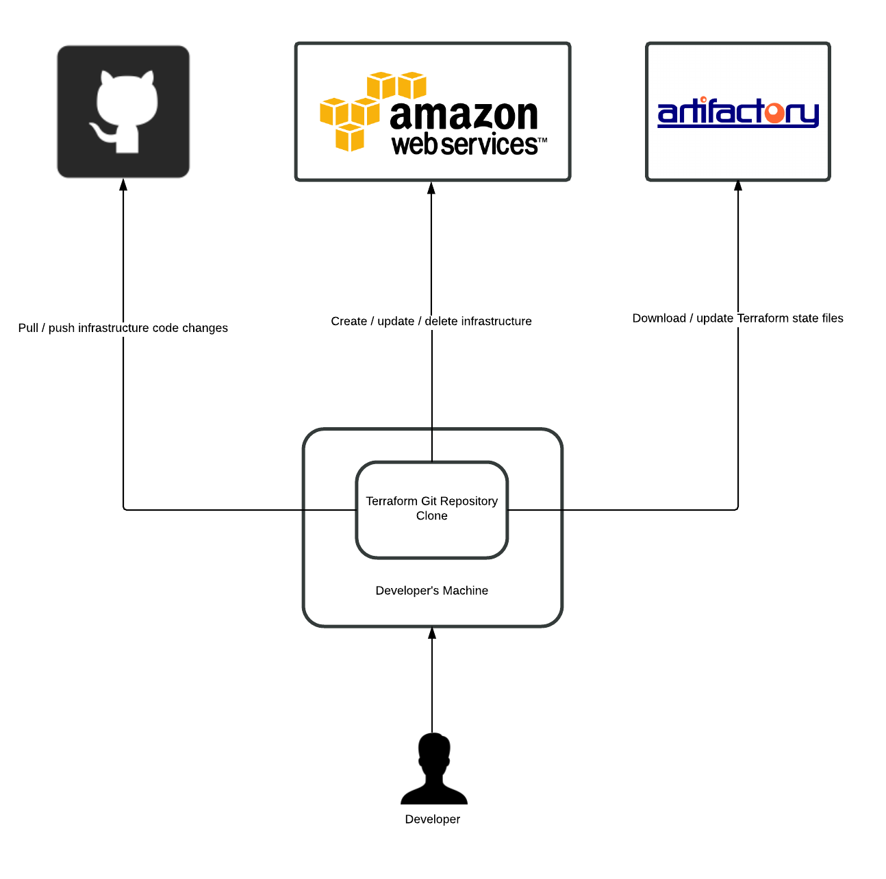

#Terraform @ TravCorp

###What is Terraform?

Have a look at the product site: https://www.terraform.io/ the creators can pitch their product better than I can.

###What do we use if for?

Currently Terraform is used for maintaining the data centre proxy (or DCProxy) VPC in our various AWS accounts, for more information on  this VPC and it's purpose please take a look at the documentation in this repository - https://github.com/travcorp/general-docs.git . It is also used for standardizing and maintaining the AWS CloudTrail configuration in our AWS accounts.

###How does it work?

Below is an overview of how Terraform has been implemented:

There five main components to this setup:

1. **GitHub** - for maintaining the Terraform source code and scripts
2. **Artifactory** - for storing the Terraform state files away from the source code
3. **Amazon Web Services** - for building our infrastructure
4. **wrapper.sh script** - for simplifying and automating Terraform
5. **credentials.sh script** - for setting up AWS and Artifactory secrets

We will go into more detail on the these below.

###Getting started

Firstly go and download Terraform for your OS here https://www.terraform.io/downloads.html and unzip it to a directory on your machine and make sure that this directory's path is included on your `%PATH%` environment variable or if you are working on a proper operating system your `$PATH` environment variable.

Since the `credentials.sh` and `wrapper.sh` scripts are written in good old fashioned Bash you will need to install Cygwin of you are working on the Windows platform. It can be downloaded here https://cygwin.com/install.html .

Once you have installed the above software you will need to clone this repository.

Now you need to set up the `credentials.sh` file with the Artifactory Terraform state file repository's details and your AWS API keys for the environments you are going to be working on. The script is very easy to understand so no need to go into anymore detail on this. **Just remember not to push your you changes to this file to Github.** You can run the following command on your local Terraform repository to ensure that any changes you make to this file are ignored `git update-index --assume-unchanged credentials.sh`.

That's it not you can start working with Terraform

###Working with Terraform

The `wrapper.sh` script is where all the magic happens and serves the following purposes:

1. Wrapping the often verbose Terraform commands
2. Allow us to have individual state files for each environment per Terraform configuration by using Artifactory as a backend for storing them

Here is the syntax of 'wrapper.sh' and the Terraform commands it supports:

####Basic wrapper.sh syntax

` ./wrapper.sh [Terraform command] [Terraform configuration] [Environment]`

This script should always be run the root of the repository so that you can pass a Terraform configuration directory as a parameter.

For example if you wanted to apply the changes you have made within the dcproxy configuration to the AWS dev environment you would execute the following command:

` ./wrapper.sh apply dcproxy dev`

####Terraform apply command

Applies changes to the target infrastructure. Find out more here https://www.terraform.io/docs/commands/apply.html

` ./wrapper.sh apply dcproxy dev`

####Terraform destroy command

Destroys the target infrastructure. Find out more here https://www.terraform.io/docs/commands/destroy.html

` ./wrapper.sh destroy cloudtrail qa`
